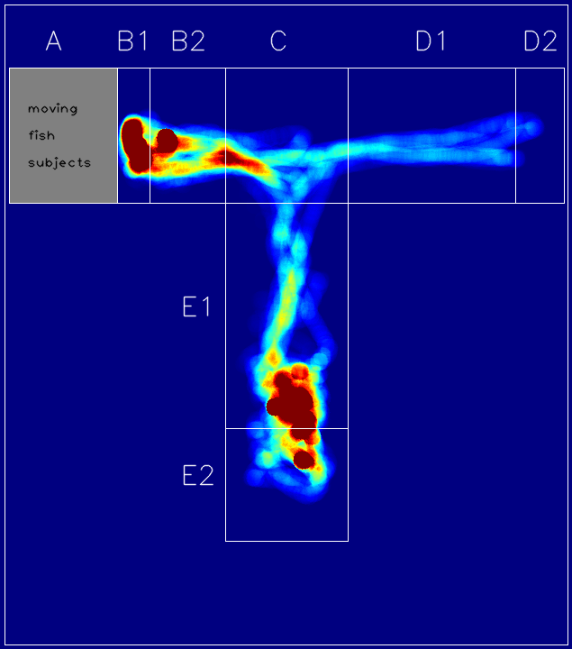
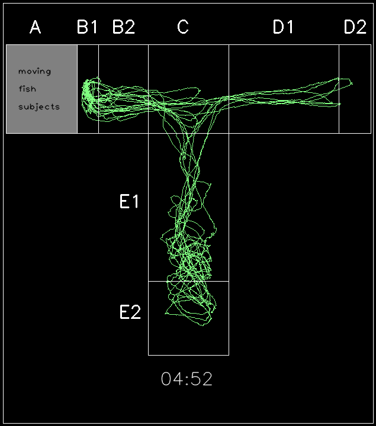

# Fish Behavior Datasets
Zebrafish and Goldfish motion tracking datasets for behavior analysis and clustering.

<table><tr>
<tr>
<td valign="bottom">
 
Example of simulation Heatmap
</td>
<td valign="bottom">
 
Example of simulation tracking
</td>
</tr></table>